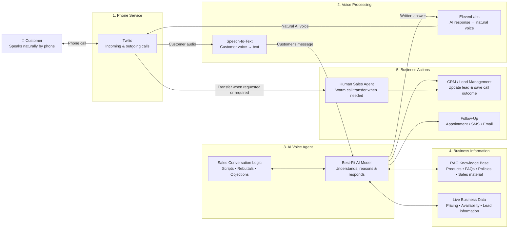

## AI Voice Sales Agent: High-Level Architecture



## Simple Client Explanation

The system works like a virtual sales representative:

1. **The customer calls or receives a call**  
   Twilio manages the phone number, inbound calls, outbound calls, and call transfers.

2. **The system understands the customer**  
   Speech-to-text converts the customer’s voice into text so the AI can understand the conversation.

3. **The AI decides how to respond**  
   A best-fit enterprise AI model follows the approved sales script, answers questions, handles objections, and decides the next action. The final model can be selected based on response quality, speed, reliability, privacy, and cost.

4. **The AI checks trusted business information**  
   Before answering, the AI can search the RAG knowledge base for product details, FAQs, policies, scripts, and rebuttals. It can also access authorized live information such as current prices, stock, availability, or lead details.

5. **The customer hears a natural voice**  
   ElevenLabs converts the AI’s answer into natural-sounding speech, which Twilio plays during the call.

6. **The system records the business outcome**  
   Important information, call summaries, customer interest, objections, and next steps can be saved in the CRM.

7. **A human can take over**  
   If the customer requests a person, qualifies as a high-value lead, or reaches a situation outside the AI’s scope, Twilio transfers the live call to a sales representative.

## Example Call Journey

```text
Customer speaks
      ↓
Twilio receives the call
      ↓
Speech-to-Text understands the request
      ↓
AI checks the sales process and relevant company information
      ↓
AI prepares an accurate response
      ↓
ElevenLabs turns the response into a natural voice
      ↓
Customer hears the answer
      ↓
CRM is updated, follow-up is scheduled, or the call is transferred
```

## Client-Ready Summary

The proposed solution will combine phone communication, natural voice technology, artificial intelligence, company knowledge, live business data, CRM integration, and human support into one connected sales system.

The AI voice agent will be able to:

- Conduct natural inbound and outbound calls
- Follow approved sales scripts
- Answer product and service questions
- Handle common objections and rebuttals
- Retrieve accurate information from the company knowledge base
- Use authorized live pricing, availability, and customer data
- Qualify leads and record call outcomes
- schedule appointments and trigger follow-ups
- Transfer qualified or complex calls to a human sales representative

The exact AI model and service configuration will be selected during implementation based on the required quality, response speed, call volume, data privacy, and operating cost.
